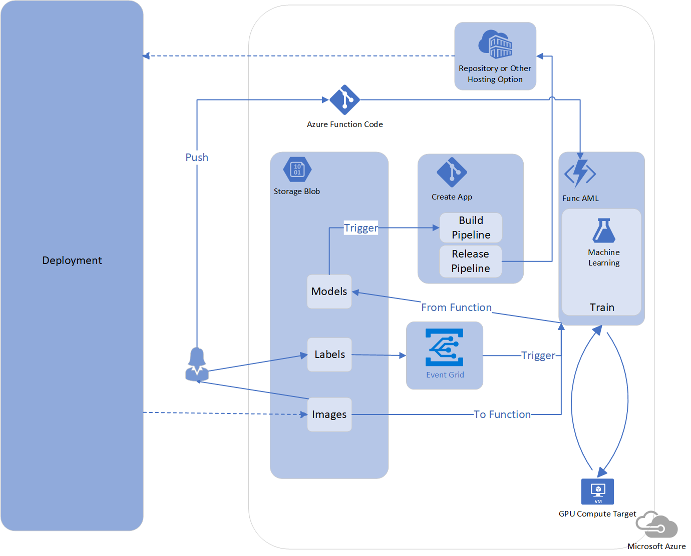

# Training a Model with Azure ML and Azure Functions

Automating the training of new ML model given code updates and/or new data with labels provided by a data scientist, can pose a challenge on the dev ops or app development side due to the manual nature of data science work.  One solution would be to use a training script (written by the data scientist) via an Azure Function (managed by the app developer) to train an ML model on a seperate compute triggered in an automated fashion (managed by the dev ops professional).

The intent of this repository is to communicate the process of training a model using a Python-based Azure Function and the Azure ML Python SDK, as well as, to provide a code sample for doing so.  Training a model with the Azure ML Python SDK involves setting, possibly provisioning and consuming an Azure Compute option (e.g. an N-Series Data Science Virtual Machine) - the model _is not_ trained within the Azure Function Consumption Plan.  Triggers for the Azure Function could be HTTP, Azure Blob Storage containers via Event Grid, or by other means.

The motivation behind this process was to provide a way to automate the model training process once the data scientist had provided new data _and_ labels which were stored in Azure Blob containers.  The idea is that once new labels were provided, it would signal training a new model and subsequently performing evaluation and A/B testing.  The downstream event from the Azure Function could be moving a model to a separate "models" Blob container.  This new model could, then, be part of an IoT Edge Module build, for example, or other app build and release.

The following example diagram represents this process as part of a larger deployment.



## Instructions

The instruction below is only an example - it follows [this Azure Docs tutorial](https://docs.microsoft.com/en-us/azure/azure-functions/functions-create-first-function-python) which should be referenced as needed.


The commands are listed here for quick reference (but if it doesn't work, check doc above as it may have updated - note, you will still need to `pip install requirements.txt` to test locally):

### Set up virtual environment

In a bash terminal, `cd` into the `dnn` folder.

* Create a fresh virtual environment for each function
* Make sure `.env` resides in main folder (same place you find `requirements.txt`)
* Use the `pip` installer from the virtual environment

```
    python3.6 -m venv .env

    source .env/bin/activate

    .env/bin/pip install -r requirements.txt
```

### Test function locally

```   
    func host start
```

### Deploy function to Azure

```
    az login

    az group create --name azfunc --location westus

    az storage account create --name azfuncstorage123 --location westus --resource-group azfunc --sku Standard_LRS

    az functionapp create --resource-group azfunc --os-type Linux --consumption-plan-location westus --runtime python --name dnnfuncapp --storage-account azfuncstorage123

    
    func azure functionapp publish dnnfuncapp --build-native-deps
```

 Add as a key/value pairs, the following (using your subscription id, workspace used with Azure ML and the Azure ML workspace - create these if they don't exist - [with code](https://docs.microsoft.com/en-us/azure/machine-learning/service/quickstart-create-workspace-with-python) or [in Azure Portal](https://docs.microsoft.com/en-us/azure/machine-learning/service/quickstart-get-started)) under **Application settings** in the "Application settings" configuration link/tab.  

1. `AZURE_SUB`
2. `RESOURCE_GROUP`
3. `WORKSPACE_NAME`
4. `STORAGE_CONTAINER_NAME_TRAINDATA`
5. `STORAGE_CONTAINER_NAME_MODELS`
5. `STORAGE_ACCOUNT_NAME`
6. `STORAGE_ACCOUNT_KEY`

Read about how to access data in blob and elsewhere with the AzureML Python SDK [here](https://docs.microsoft.com/en-us/azure/machine-learning/service/how-to-access-data).

### Test deployment

```
    curl https://dnnfuncapp.azurewebsites.net/api/HttpTrigger?<a key defined in code>=<some test value>
```


